# Projeto Banco — API

## 1. Identificação

| Nome | RM |
|---|---|
| Maria Clara | RM557478 |
| Vinicius Matareli | RM555200 |

---

## 2. Produto Bancário Escolhido

**Empréstimo Pessoal**

O produto escolhido foi o **Empréstimo Pessoal**. A justificativa para essa escolha está na possibilidade de implementar uma regra de negócio concreta: a **análise de crédito automatizada**. Toda solicitação de contratação é publicada de forma assíncrona em uma fila RabbitMQ e processada por um _background service_ (Consumer), que avalia o pedido e atualiza o status da contratação para `Aprovada` ou `Reprovada`. Esse fluxo reflete o comportamento real de sistemas bancários digitais, onde operações de crédito não podem ser resolvidas de forma síncrona, exigindo processamento em segundo plano com possibilidade de reprocessamento em caso de falha.

---

## 3. Diagrama de Classes

> Arquivo disponível em `docs/diagrama-classes.drawio` e `docs/diagrama-classes.png`.

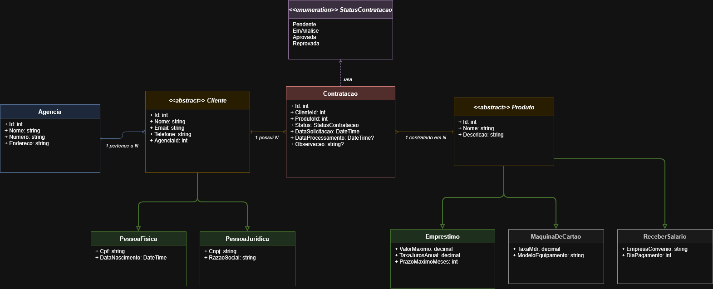

**Descrição do domínio:**

- `Cliente` é uma entidade abstrata com herança TPH (Table Per Hierarchy), especializada em `PessoaFisica` (CPF + DataNascimento) e `PessoaJuridica` (CNPJ + RazãoSocial)
- `Produto` é uma entidade abstrata com herança TPH, especializada em `Emprestimo` (implementado), `MaquinaDeCartao` e `ReceberSalario` (presentes no diagrama)
- `Agencia` possui relacionamento 1:N com `Cliente`
- `Contratacao` associa `Cliente` e `Produto`, com status controlado pelo enum `StatusContratacao`

---

## 4. Stack Tecnológica

| Camada | Tecnologia | Versão |
|---|---|---|
| Runtime | .NET | 8.0 |
| API | ASP.NET Core Web API | 8.0 |
| ORM | Entity Framework Core | 8.0.0 |
| Driver Oracle | Oracle.EntityFrameworkCore | 8.21.121 |
| Banco de dados | Oracle Database | oracle.fiap.com.br:1521/ORCL |
| Mensageria | RabbitMQ | 4.3.0 (Erlang 28.5) |
| Cliente RabbitMQ | RabbitMQ.Client | 6.8.1 |
| Documentação | Swashbuckle (Swagger) | 6.6.2 |
| Testes | xUnit | 2.9.3 |
| Mocks | Moq | 4.20.72 |
| Banco em memória (testes) | EF Core InMemory | 8.0.0 |

---

## 5. Endpoints Disponíveis

### POST `/api/agencias` — Cadastrar Agência

**Request:**
```json
{
  "nome": "Agência Centro",
  "numero": "0001",
  "endereco": "Av. Paulista, 1000"
}
```

**Response 201:**
```json
{
  "id": 1,
  "nome": "Agência Centro",
  "numero": "0001",
  "endereco": "Av. Paulista, 1000"
}
```
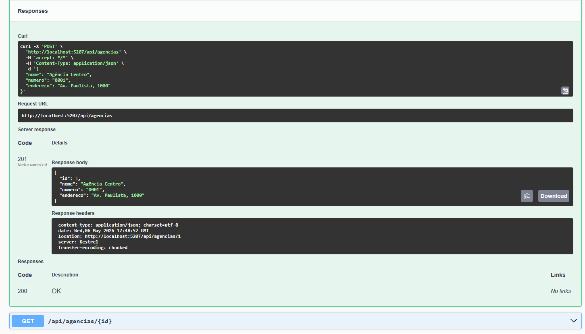

---
 
### GET `/api/agencias/{id}` — Buscar Agência por ID
 
**Response 200:**
```json
{
  "id": 1,
  "nome": "Agência Centro",
  "numero": "0001",
  "endereco": "Av. Paulista, 1000"
}
```
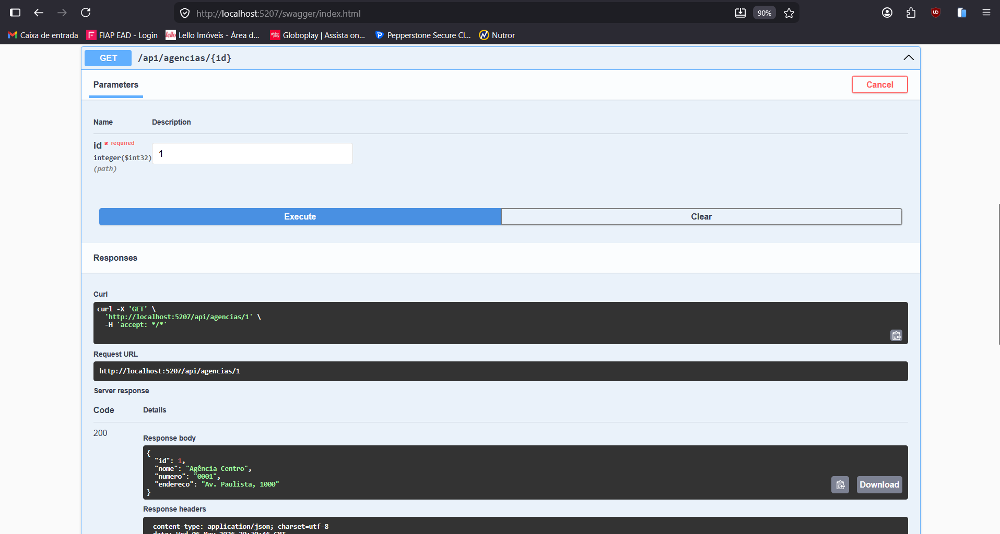

---

### POST `/api/clientes/pf` — Cadastrar Pessoa Física

**Request:**
```json
{
  "nome": "Maria Clara",
  "email": "maria@clara.com",
  "telefone": "11999999999",
  "agenciaId": 1,
  "cpf": "12345678901",
  "dataNascimento": "2003-05-09"
}
```

**Response 201:**
```json
{
  "id": 1,
  "nome": "Maria Clara",
  "email": "maria@clara.com",
  "telefone": "11999999999",
  "tipo": "PF",
  "documento": "12345678901",
  "agenciaId": 1
}
```
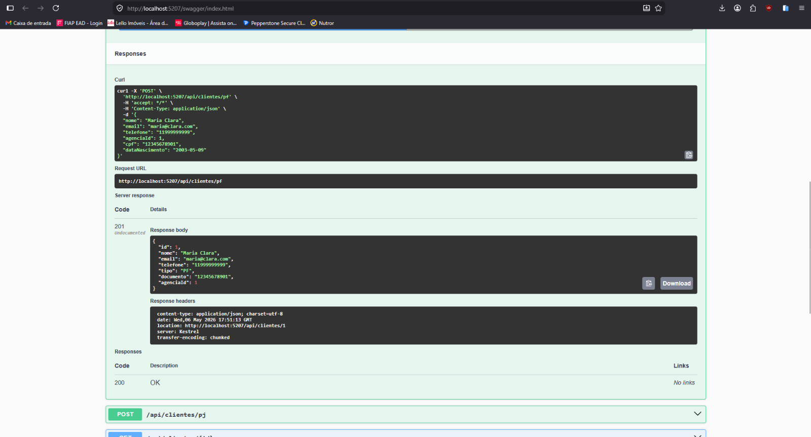

---

### POST `/api/clientes/pj` — Cadastrar Pessoa Jurídica

**Request:**
```json
{
  "nome": "Empresa Vinicius Matareli",
  "email": "vinicius@empresa.com",
  "telefone": "1133333333",
  "agenciaId": 1,
  "cnpj": "12345678000199",
  "razaoSocial": "Empresa Vinicius Matareli LTDA"
}
```

**Response 201:**
```json
{
  "id": 2,
  "nome": "Empresa Vinicius Matareli",
  "email": "vinicius@empresa.com",
  "telefone": "1133333333",
  "tipo": "PJ",
  "documento": "12345678000199",
  "agenciaId": 1
}
```
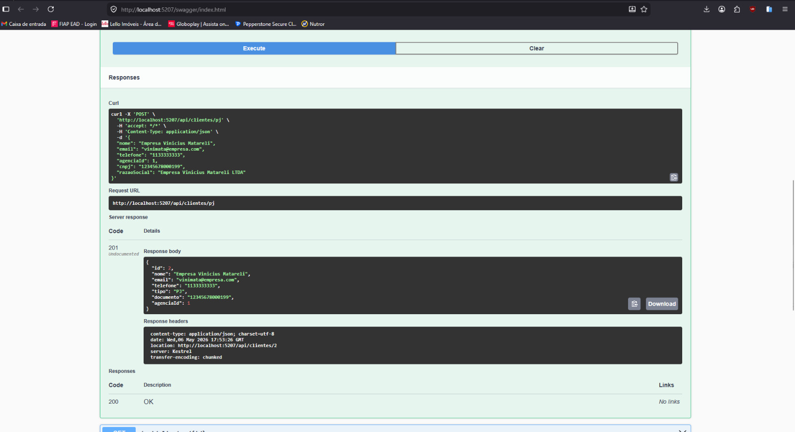

---
 
### GET `/api/clientes/{id}` — Buscar Cliente por ID
 
**Response 200:**
```json
{
  "id": 1,
  "nome": "Maria Clara",
  "email": "maria@clara.com",
  "telefone": "11999999999",
  "tipo": "PF",
  "documento": "12345678901",
  "agenciaId": 1
}
```
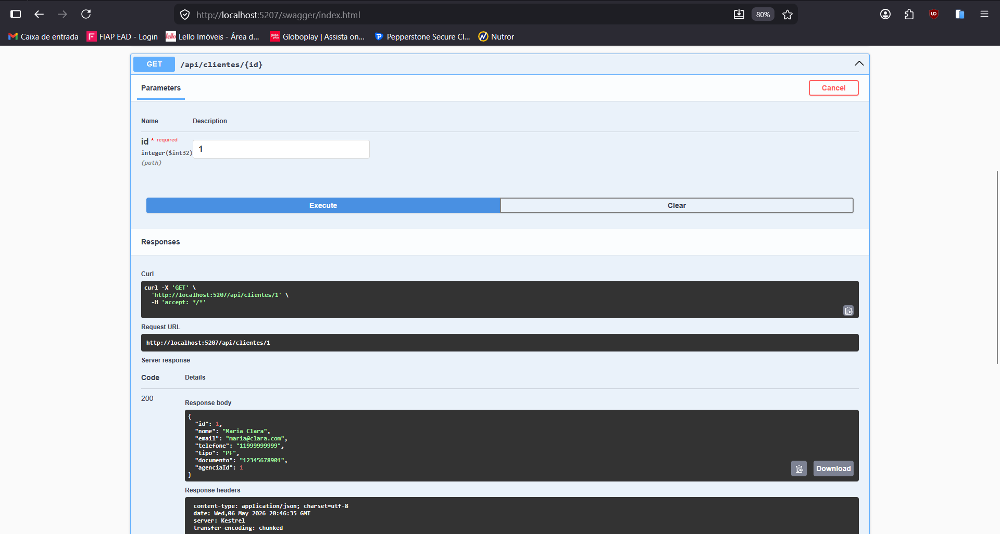

---

**Response 200:**
```json
{
  "id": 2,
  "nome": "Empresa Vinicius Matareli",
  "email": "vinimata@empresa.com",
  "telefone": "1133333333",
  "tipo": "PJ",
  "documento": "12345678000199",
  "agenciaId": 1
}
```


---


### POST `/api/contratacoes` — Solicitar Contratação

A contratação é publicada na fila RabbitMQ e processada de forma **assíncrona** pelo Consumer. O status inicial retornado é `Pendente`.

**Request:**
```json
{
  "clienteId": 1,
  "produtoId": 1
}
```

**Response 202:**
```json
{
  "id": 1,
  "clienteId": 1,
  "produtoId": 1,
  "status": "Pendente",
  "dataSolicitacao": "2026-05-06T17:54:15.9400743Z",
  "observacao": null
}
```
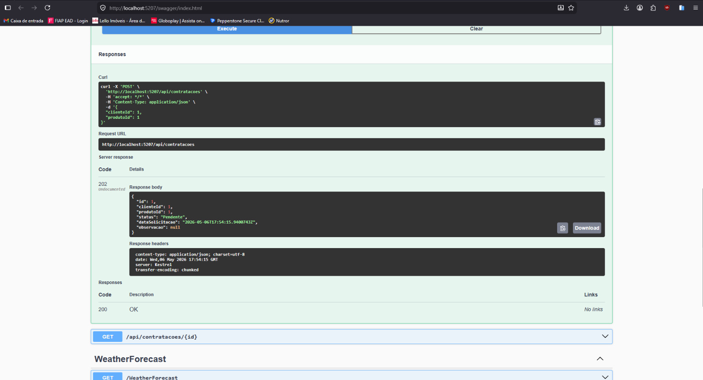

---

### GET `/api/contratacoes/{id}` — Consultar Status da Contratação

Após o processamento pelo Consumer, o status é atualizado para `Aprovada` ou `Reprovada`.

**Response 200:**
```json
{
  "id": 1,
  "clienteId": 1,
  "produtoId": 1,
  "status": "Aprovada",
  "dataSolicitacao": "2026-05-06T17:54:15.9400743Z",
  "observacao": "Aprovado pela análise de crédito automatizada."
}
```
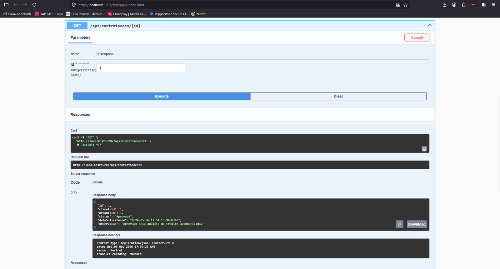

---

## 6. Testes — Como Executar

```bash
dotnet test
```

**Resultado obtido:**

```
Test summary: total: 7; failed: 0; succeeded: 7; skipped: 0; duration: 12,0s
Build succeeded with 2 warning(s) in 17,8s
```

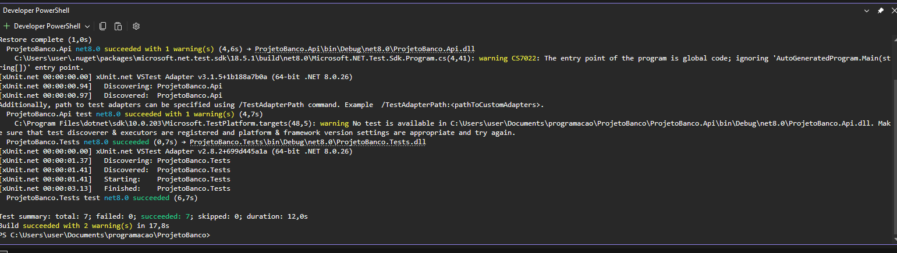

**Fluxos críticos cobertos:**

| Fluxo | Comportamento esperado |
|---|---|
| Cadastro de PF com sucesso | Retorna 201 |
| CPF duplicado | Retorna 409 Conflict |
| Agência inexistente ao cadastrar cliente | Retorna 400 Bad Request |
| CNPJ duplicado | Retorna 409 Conflict |
| Contratação para cliente inexistente | Retorna 404 Not Found |
| Contratação válida publicada na fila | Retorna 202 Accepted |

---

## 7. Evidências de Funcionamento

### Swagger — Endpoints disponíveis

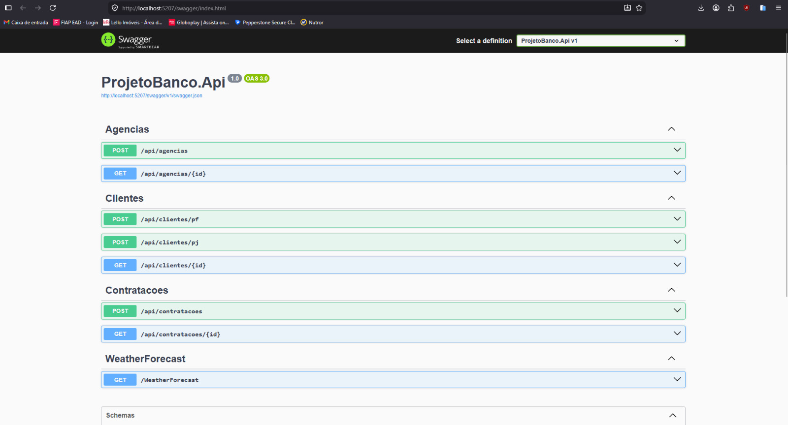

### Swagger — Contratação aprovada

> GET `/api/contratacoes/1` retornando status `Aprovada` após processamento assíncrono pelo Consumer:


### RabbitMQ — Fila `contratacoes`

> Painel do RabbitMQ mostrando a fila `contratacoes` criada e em execução:

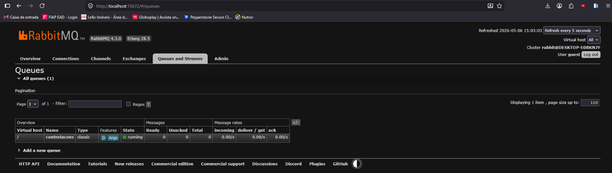

---

## 8. Como Executar o Projeto

### Pré-requisitos

- .NET 8.0 SDK
- RabbitMQ rodando em `localhost:5672`
- Acesso ao Oracle FIAP (`oracle.fiap.com.br:1521/ORCL`)

### Passos

```bash
# 1. Restaurar dependências
dotnet restore

# 2. Aplicar migrations no Oracle
dotnet ef database update --project ProjetoBanco.Api

# 3. Rodar a API
dotnet run --project ProjetoBanco.Api

# 4. Acessar o Swagger
# http://localhost:5207/swagger
```

### Configuração — `appsettings.json`
> Edite para colocar o seu User e a sua Password
```json
{
  "ConnectionStrings": {
    "OracleConnection": "User Id=rm123456;Password=123456;Data Source=oracle.fiap.com.br:1521/ORCL;"
  },
  "RabbitMQ": {
    "Host": "localhost",
    "Queue": "contratacoes"
  }
}
```
